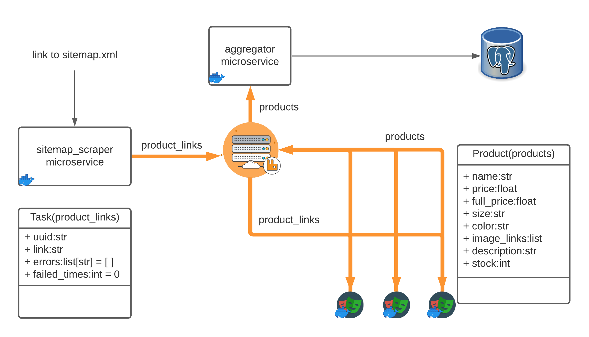

# Zelf Assignment

Web Scraping System design/development project for interview at [Zelf](https://hellozelf.com/)

## Index

1. [How to run?](#how-to-run)
2. [Project Architecture Overview](#project-architecture-overview)
3. [Scope for improvement](#scope-for-improvement)
4. [Suggestions](#suggestions)
5. [Assignment Details](#assignment-details)
6. [Site Research](#research-of-the-site)

## How to run?

### With Docker

``` bash
docker compose up -d --scale product_scraper=5
```

The above command will run all the micro services and necessary infrastructure automatically.

### How to see data

Sorry, I didn't have the time to build a web service to view the data, I initially planned on
building one. Currently, we can connect to the postgresql service running on the docker container
from the command line and see the data.

``` bash
psql -h localhost -p 5438 -d postgres -U postgres -W
```

Provide `postgres` as password, when prompted. Then we can use standard SQL queries to
see the available data.

``` sql
SELECT name, size, price, color, stock FROM product;
```

## Project Architecture Overview



The **Scraping System** consists of 3 micro services and 2 infrastructure programs.

The micro services are:

1. [sitemap_scraper](#sitemap_scraper)
2. [product_scraper](#product_scraper) (pictured with playwright logo in the diagram)
3. [aggregator_service](#aggregator_service)

The infrastructure programs are:

1. [RabbitMQ](#rabbitmq)
2. [PostgreSQL](#postgresql)

All of these micro services communicate with each other through RabbitMQ channels. The services
have Dockerfile and they can be started with the provided docker-compose.yml file. All Dockerfiles are optimized to not have any extra dependencies. But are not using the minimal
base images to reduce build time. The images can be swapped with minimal images when it's time
to deploy (This might not be a drop in replacement and might require some extra work).

### Details of the services

#### sitemap_scraper

This service is geared for traversing the target website's sitemap.xml and find product links.
This module uses python `requests` and `re` libraries. After traversing the sitemap.xml,
the service creates a UUID for each found product link and creates a
Task object which is then *pickled* and sent to RabbitMQ `product_links` queue for further
processing by the [product_scraper](#product_scraper) service. After all the tasks are sent
to the queue the program exits and so does the *Docker Container*. This service is very
**fast** and typically takes around 10s to do it's job and exit.

#### product_scraper

Product Scraper service consumes tasks from `product_links` RabbitMQ queue and scrapes
data as per the [specification](#specification) from the product page. It uses Playwright
to control a headless Chromium browser instance and extract the required information.
When the information collection is done, it creates a Product object which is then *pickled*
and sent to RabbitMQ `product` queue for the [aggregator_service](#aggregator_service) to
further process. The reasons that influenced choices made while writing the scraper
can be found at [Site Research](#research-of-the-site) section.

The docker container running this is kept hot. Meaning, the browser instance is never
shutdown, only the tabs/pages are closed when it's done scraping. This is done to increase
speed and not wait for the browser to start or close.

!!! Maybe it's just my location but, site load with playwright takes around 20s !!!

#### aggregator_service

Service to store product data to a database. In current form, it consumes the `product` queue
and from the Product object, pushes the data to the attached PostgreSQL database.

Why this is a separate service? The *product_scraper* could do it.
Boundaries. And flexibility. We can change database or data storing behavior or product
schema while the scrapers are running, without ever touching them.

*NB: The current product schema is not that good. Need to design a relational schema with
base product and it's variants and price.*

### Reason behind choosing infra services

#### RabbitMQ

1. Message Acknowledgement. When message is consumed, RabbitMQ doesn't forget about the message. Rather, it waits for the consumer to acknowledge that the message was successfully processed. If the consumer, fails to acknowledge this due to a crash, the message is automatically requeued.
2. Multiple types to delivery methods with exchanges.
3. Persistent messages.
4. Durable channel. (Doesn't reset if the RabbitMQ server crashes)
5. Very flexible and plenty of room to grow if the needs increases.
6. Very high throughput.

#### PostgreSQL

Just needed a database. Any database could have been chosen. Chose psql because, have
been using it in all projects recently.

## Scope for improvement

1. Better logging. Currently there is minimal/no logging. Need to integrate a logging server/method.
2. More sophisticated reconnect logic for RabbitMQ and database connection.
3. Replace my `bus` library with new wrapper library. Because it was written a long time (2019) ago and it was written to be clever instead of maintainable.
4. Find better tools for maintaining monorepo.
5. Remove tasks from active processing queue if the task has already failed a certain number of times. Failed times is already a data point for the task class.
6. Use pydantic for the creation of dataclass.  Because @dataclass doesn't provide validation when creating the object.

## Suggestions

1. Link of the product can be stored.
2. Since the target website is fully hydrated and doesn't rely on JavaScript to populate data on the web page, I think, requests + beautifulsoup is a better tool for this particular website. Specially after noticing how much resources Playwright needs.

## Assignment Details

### Site to scrape

`https://us.princesspolly.com/`

### Specification

Example product link: `https://us.princesspolly.com/products/huxley-set?nosto=frontpage-nosto-3`

- All product variants
  - For the URL above, the product can come in five colors and seven sizes per
      color, for a total of 35 variants
  - For each variant, what is the
    - Current price
    - Full price (this may be the same as the current price)
    - Is the item available and in-stock?
    - URLs for photos
- The following information
  - Product name
  - Product description

## Research of the site

This section is dedicated to find out anomalies of products for reference:

- Sold out example: `https://us.princesspolly.com/products/charvi-mini-dress-forest-burgundy?variant=39519437619284`
- Price Discount example: `https://us.princesspolly.com/products/the-soho-heels-beige`
- There is a occasional banner that pops up whose selector is: `close-button cw-close`
- The price for all the sizes must be same because there is **no network activity** when different sizes are selected
- In all product list, different color variants of the same product is served. So it's not reliable to get the original
  product that way.
  - possible approaches:
    - if product `color name` exists in product name then subtract the color to get the base products
    - if product name doesn't contain `color name` then the product name will be the base product
